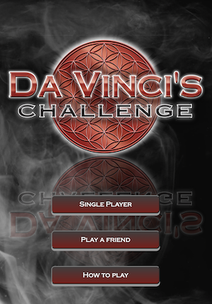

# Da Vinci's Challenge



[Da Vinci's Challenge](https://en.wikipedia.org/wiki/Da_Vinci%27s_Challenge) is a game of patterns inspired by a geometric construction drawn by Leonardo da Vinci. The player's objective is to score the most points by using pieces to create patterns worth different point values. This is complicated because patterns can overlap. Pieces can also be used to block the opponent from creating patterns. The game ends when no more patterns can be made by either side. The player with the highest score is the winner.


As of 7/21/2023, this is still a work in progress. But we're getting close! Stay tuned.

## Install

```
git clone https://github.com/JasonVonKrueger/dvc.git
cd dvc
npm install
npm start
```

Launch a browser and go to http://localhost:9115

You'll want to either adjust the size of the browser window or open the debugger tools and switch the resolution to a mobile display (Chrome).

## Resuming a game

No match — single player, local pass-and-play, or remote `Play a friend` — has to be finished in one sitting. Each browser remembers the last game it took part in (via IndexedDB), and the splash screen offers a "Resume game" button back into it as long as the game is still active. This works the same way for all three game types.

`Play a friend` games have one extra trick: since the other player is on a different device, a real push notification (see below) is sent to whichever player is up next, with a deep link that jumps straight back into the match.

## Push notifications ("it's your turn")

Remote (`Play a friend`) games send a real push notification to whichever player is up next, so they don't have to keep the app open waiting for their opponent. This uses Web Push (VAPID), which needs a keypair the server signs messages with.

Nothing is sent unless a player opts in via the **"Allow notifications"** toggle in the in-game Options menu — there's no automatic prompt on game start (browsers ignore/reject permission prompts that aren't triggered by an actual click). Turning the toggle off unsubscribes and stops future notifications, but it can't revoke the browser's own notification permission — that's a one-way grant only the player can undo from their browser's site settings.

**Without any setup**, the app still runs fine locally — `lib/push.js` auto-generates a temporary keypair on boot and logs a warning. That's fine for poking around, but every restart invalidates it, so any existing subscriptions silently stop working. Set real keys (below) for anything you don't want to keep re-subscribing to.

### Generate a keypair

```
npx web-push generate-vapid-keys
```

This prints a `Public Key` and `Private Key`. The private key is a secret — never commit it.

### Local dev

Copy `.env.example` to `.env` and fill in the keys you just generated:

```
cp .env.example .env
```

`app.js` loads `.env` automatically on startup (via `dotenv`) if one exists, so `npm start` just picks it up — no exporting needed. `.env` is gitignored; never commit it.

(You can still `export VAPID_PUBLIC_KEY=...`/`export VAPID_PRIVATE_KEY=...` by hand instead if you'd rather not use a file — either way ends up in `process.env`, which is all `lib/push.js` actually reads.)

`VAPID_SUBJECT` is optional and defaults to `mailto:admin@davincischallenge.app` (`lib/push.js`) — only set it if push services should contact a different address about your server.

### Production

Set `VAPID_PUBLIC_KEY`, `VAPID_PRIVATE_KEY`, and (optionally) `VAPID_SUBJECT` as real environment variables on the server, the same way `ADMIN_TOKEN` is set today. Generate the keypair **once** and reuse it across deploys/restarts; generating a new one invalidates every player's existing subscription.

If the app runs under pm2 (see `scripts/deploy.sh`), pm2 caches the environment from when a process was first started, so after adding these vars you'll need:

```
pm2 restart dvc --update-env
```

instead of a plain `pm2 restart` for it to pick them up.


