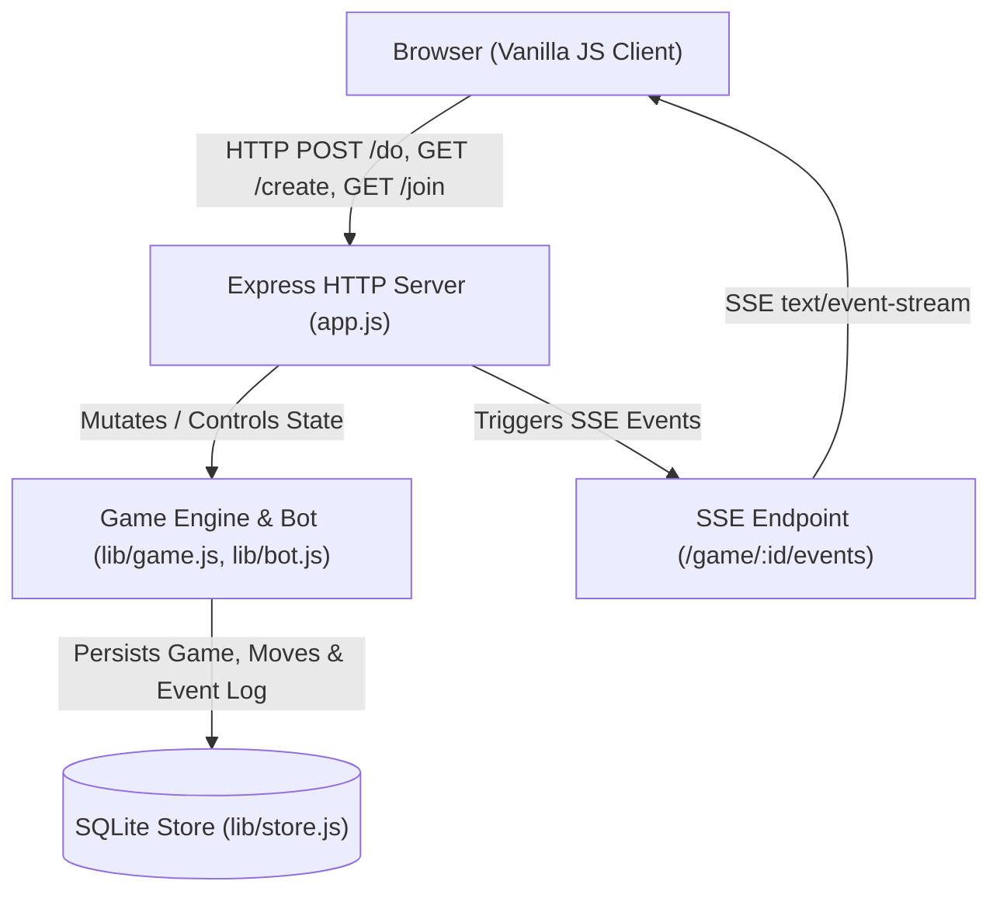
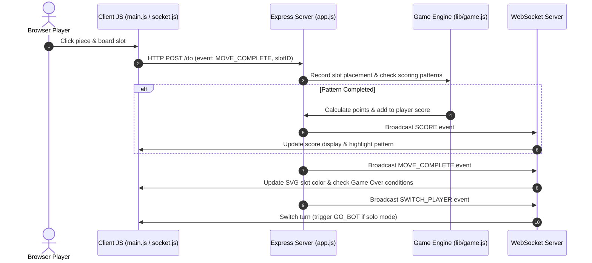

# Da Vinci's Challenge Architecture

## Executive Overview

**Da Vinci's Challenge** (DVC) is a full-stack, real-time strategy game inspired by the geometric construction drawn by Leonardo da Vinci. Players alternate placing oval and triangular pieces onto a Flower of Life board layout to complete geometric scoring patterns (triangles, ovals, stars, flowers, etc.).

The system architecture consists of:
- **Client (Frontend)**: Vanilla JavaScript ES6+, HTML5, and CSS3 styled with a custom parchment aesthetic. Real-time updates use native **Server-Sent Events (SSE)** via `EventSource`. Sound effects are powered by **Howler.js**.
- **Server (Backend)**: Node.js, Express web server with dedicated SSE streams.
- **Persistence Layer**: Local SQLite database via `lib/store.js` / `lib/db.js` on the server and IndexedDB storage on the client for local player identity.

---

## High-Level Component Diagram

---

## Key Modules & Responsibilities

### 1. Server & Routing (`app.js`)
- **Static Asset Delivery**: Serves client files from the `public/` directory.
- **HTTP REST Endpoints**:
  - `GET /create/:gameType`: Instantiates a new `Game` model.
  - `GET /join/:gameID/:playerNumber`: Joins player 1 or player 2 (or initializes a bot for solo play).
  - `POST /do`: Command handler receiving game events (`START_GAME`, `MOVE_STARTED`, `MOVE_COMPLETE`, `SWITCH_PLAYER`, `GO_BOT`).
- **WebSocket Upgrade**: Upgrades requests on `/sockets` to maintain a real-time event channel with connected browsers.

### 2. Core Game Logic (`lib/game.js`, `lib/bot.js`)
- **`Game` Class**: Holds player metadata, current player turn, active piece counts (ovals and triangles), and remaining available slots on the board.
- **Reverse Pattern Indexing (`lib/pattern_index.js` & `lib/score_patterns.json`)**: Maps placed slot IDs directly to potential scoring pattern candidates. Instead of scanning all possible patterns on every move, only candidate patterns touching the placed slot are evaluated.
- **AI Bot (`lib/bot.js`)**: Evaluates board state and available moves using a priority heuristic:
  1. Complete winning pattern immediately.
  2. Block opponent's high-value pattern.
  3. Advance towards completing an open pattern.
  4. Fallback to strategic open slot selection.

### 3. Client Architecture (`public/`)
- **`public/index.html`**: Main HTML document providing the board viewport, scoreboards, and modal layers (Rules, Options, Play a Friend, Game Over).
- **`public/resources/js/main.js`**: Client entry point managing DOM event listeners, board animations, game setup, move submission, sound effects, and testing mode toggles.
- **`public/resources/js/sse.js`**: Server-Sent Events client that listens for streamed events (`GAME_STARTED`, `MOVE_COMPLETE`, `SWITCH_PLAYER`, `STAGE_BOT`, `SCORE`) and updates local DOM state accordingly. `connectGameStream()` returns a promise that resolves once the subscription is live, so callers that need to trigger a broadcast of their own right after connecting (see Game Resumption below) don't race the handshake.
- **`public/resources/js/storage.js`**: IndexedDB wrapper that persists the player's generated identity (`playerName`) and a pointer to their most recent game (`lastGame`: gameID + seat) across browser restarts — the basis for the "Resume game" flow.
- **`public/resources/classes/`**:
  - `Game.js`: Client-side state container.
  - `GamePiece.js`: Manages visual game piece instantiation, SVG placement, and click handlers in player cups.

---

## Data Flow & Event Lifecycle

---

## Key Features & Mechanics

### 1. Reverse Pattern Lookup & Scoring
Board patterns are defined in `lib/score_patterns.json`. When a move is completed:
1. The placed slot ID is queried in `Game.patternIndex`.
2. Only matching candidate patterns are evaluated against the current player's claimed slots.
3. Successfully completed pattern indices are added to `Game.claimedPatterns` to prevent duplicate scoring.

### 2. Audio Subsystem (Howler.js)
Sound effects (`click`, `dropping-pieces`, `pickpiece`, `symbol-formed`) and background music (`davinci-music`) utilize **Howler.js**.
- **Dual Formats**: Audio assets support `.webm` as the primary web-optimized audio format with `.mp3` fallbacks.
- **Audio Controls**: Global volume and sound effect muting are controlled via options handlers in `main.js`.

### 3. Development / Testing Mode
A **Testing** toggle is available on the bottom-left of the main title screen (`splash-screen.html`).
- When enabled, initial player piece counts are reduced to 1/4 of their normal total (12 ovals, 7 triangles).
- Bot piece numbering (`blackOval45` downwards) seamlessly aligns with server piece tracking.

### 4. Game Over Detection & Display
The game checks end conditions immediately after updating board state:
- **Triggers**:
  1. A player depletes all of their remaining pieces (0 ovals AND 0 triangles).
  2. No legal open slots remain on the board or neither player has valid pieces for remaining open slots.
- **UI Presentation**: Displays a centered modal (`#game-over-modal`) with prominent "Game Over" typography and announces the winner (or a tie) based on final score totals.

### 5. Game Resumption / State Rehydration
No game type — solo, local pass-and-play, or remote friend — has to be finished in one sitting. The server already persists every game (SQLite via `lib/store.js`) and `GET /game/:gameID/state` returns full board/score/turn state for any game type, so resumption is driven entirely from the client:
- **Remembering the last game**: `storage.js` writes `{ gameID, playerNumber }` to IndexedDB (`saveLastGame`) whenever a game is created or successfully restored, for any type. On a plain page load with no `?join=`/`?resume=` link, `offerResumeIfAvailable()` (`main.js`) checks that pointer against `/game/:gameID/state`; if the game is still active it un-hides the splash screen's "Resume game" button.
- **Rehydrating the board**: `restoreGameState()` (`main.js`) repaints already-placed pieces, derives each side's true remaining piece counts from their placed-slot lists (not the `remainingOvals`/`remainingTriangles` fields, which are only authoritative for the bot), and restores the scoreboard and whose turn it is via `initBoard()`.
- **Per-type quirks on resume**:
  - **Local pass-and-play**: one device speaks for whichever seat is currently up, so the resumed seat is set directly from `currentPlayer` rather than by matching a stored identity name.
  - **Solo (vs. bot)**: if resuming lands mid-bot-turn, the `SWITCH_PLAYER` event that would normally trigger `GO_BOT` already happened before this reconnect, so `restoreGameState()` fires `GO_BOT` itself once `connectGameStream()`'s returned promise confirms the SSE subscription is live (avoiding a race where the bot's `STAGE_BOT` broadcast fires before the client is listening).
  - **Remote friend**: also reachable via a push-notification deep link (`/index.html?resume=<gameID>`, see `notifyPlayerTurn` in `app.js`), independent of the IndexedDB pointer — this is the only type that sends a cross-device "it's your turn" push, since it's the only type where the other player isn't on the same device.

---

## Database Schema (`lib/db.js`)

Persisted via SQLite:
- `games`: `id`, `type`, `status`, `current_player`, `winner`, `created_at`, `updated_at`
- `game_players`: `game_id`, `player_number`, `player_id`, `joined`, `is_bot`, `score`, `remaining_ovals`, `remaining_triangles`
- `game_moves`: `id`, `game_id`, `player_number`, `slot_id`, `created_at`
- `game_scored_patterns`: `id`, `game_id`, `player_number`, `move_id`, `symbol`, `pattern_index`, `points`, `slots_json`, `created_at`
