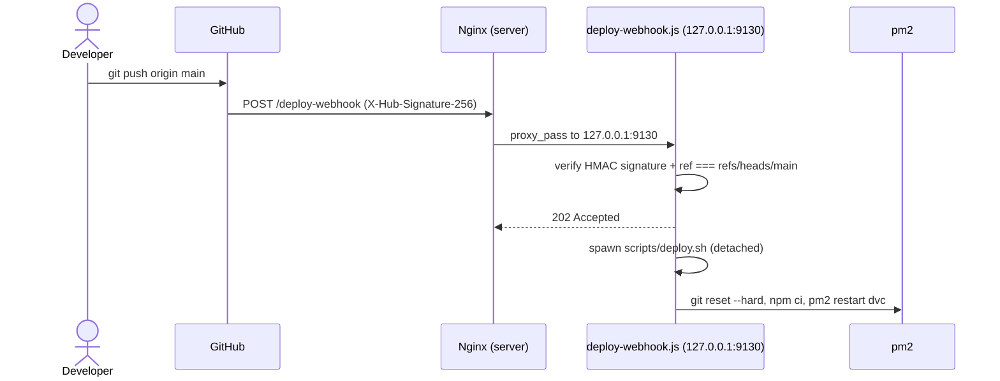

# Deployment

Pushes to `main` are automatically deployed to production via a GitHub webhook — no SSH from GitHub to the server is involved, and no self-hosted Actions runner is used (see "Why not X" below).

## How it works



1. `git push` to `main` triggers a GitHub repository webhook (Settings → Webhooks), configured with `application/json` payloads and a shared secret.
2. GitHub POSTs to `https://<domain>/deploy-webhook`. Nginx reverse-proxies that path to [scripts/deploy-webhook.js](../scripts/deploy-webhook.js), an Express listener bound only to `127.0.0.1:9130` (never exposed directly to the internet).
3. The listener verifies the `X-Hub-Signature-256` header (HMAC-SHA256 of the raw request body using `DEPLOY_WEBHOOK_SECRET`) and confirms the event is a `push` to `refs/heads/main`. Anything else is rejected/ignored.
4. It responds `202` immediately, then runs [scripts/deploy.sh](../scripts/deploy.sh) as a detached child process:
   ```bash
   git fetch origin
   git reset --hard origin/main
   npm ci --omit=dev
   pm2 restart dvc || pm2 start app.js --name dvc
   ```
5. [.github/workflows/ci.yml](../.github/workflows/ci.yml) separately runs the test suite on GitHub-hosted runners for every push/PR, but that workflow has no deployment step and needs no server access.

## One-time server setup

1. **Generate a webhook secret:**
   ```bash
   openssl rand -hex 32
   ```
2. **Export it** so pm2 picks it up (e.g. add to the shell profile you use before starting pm2, or a sourced env file):
   ```bash
   export DEPLOY_WEBHOOK_SECRET="<the generated secret>"
   ```
3. **Start the webhook listener** under pm2, alongside the existing `dvc` process:
   ```bash
   cd /home/hosted-apps/dev/dvc
   pm2 start scripts/deploy-webhook.js --name deploy-webhook
   pm2 save
   ```
4. **Add an Nginx location block** (in the same server block that proxies the game app) so only this one path is forwarded to the internal listener:
   ```nginx
   location /deploy-webhook {
       proxy_pass http://127.0.0.1:9130/deploy-webhook;
       proxy_set_header Host $host;
       proxy_set_header X-Real-IP $remote_addr;
   }
   ```
   Then reload Nginx:
   ```bash
   sudo nginx -t && sudo systemctl reload nginx
   ```
5. **Register the webhook on GitHub**: repo → **Settings → Webhooks → Add webhook**
   - Payload URL: `https://<domain>/deploy-webhook`
   - Content type: `application/json`
   - Secret: same value as `DEPLOY_WEBHOOK_SECRET`
   - Events: **Just the push event**

## Verifying a deploy

- GitHub: repo → **Settings → Webhooks → (the webhook) → Recent Deliveries** shows each attempt and the response code (`202` = accepted and deploying, `401` = signature mismatch, `200` = ignored/not a push-to-main event).
- Server: `pm2 logs deploy-webhook` shows `[deploy] triggered by <user> at <timestamp>` plus the `deploy.sh` output (or `[deploy] failed: ...` on error).
- `pm2 logs dvc` / `pm2 status` confirm the game server restarted cleanly after a deploy.

## Why not GitHub Actions + SSH, or a self-hosted runner?

- **SSH from GitHub-hosted Actions runners**: attempted first, but connections from GitHub's Azure-hosted runner IPs never reached the server (confirmed via server-side firewall/log inspection showing normal traffic, including bot scans, arriving fine — just nothing from the runner's connection window). This points to an ISP/router-level block on datacenter-sourced traffic that isn't practical to work around, since GitHub's runner IP ranges are large and rotate.
- **Self-hosted Actions runner**: would sidestep the inbound-connection problem (it polls GitHub outbound), but GitHub explicitly warns against self-hosted runners on **public** repositories — a malicious pull request from a fork could execute arbitrary code on the runner's host if any workflow in the repo is PR-triggered. The webhook approach avoids running any GitHub-supplied workflow code on the server at all; the only thing that runs is our own `deploy.sh`, and only after signature verification.
