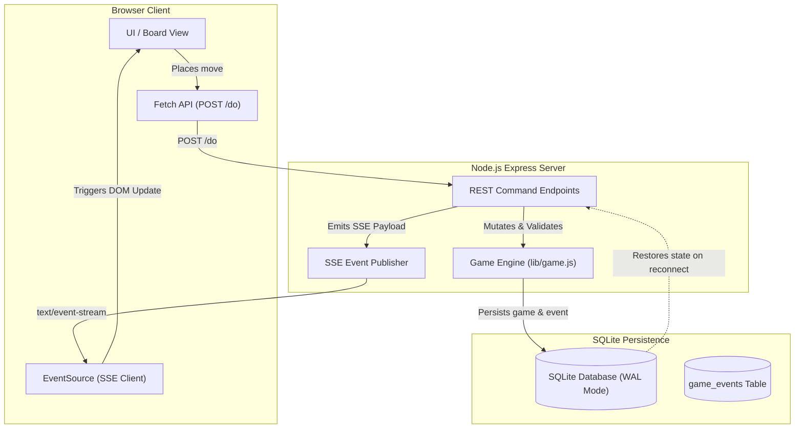

# SQLite + Server-Sent Events (SSE) Refactoring Plan

## Executive Summary

This document outlines the step-by-step migration plan for **Da Vinci's Challenge** from WebSocket broadcasts to a persistent architecture using an **SQLite Event Log** combined with **Server-Sent Events (SSE)**.

### Objectives
1. **Full State Persistence**: Save every game creation, turn, score update, and move event to SQLite so games survive server restarts, browser refreshes, and network disconnections.
2. **Native Automatic Reconnection**: Leverage browser `EventSource` built-in automatic reconnect capabilities and `Last-Event-ID` header handling to seamlessly recover from temporary dropouts.
3. **Streamlined Protocol**: Eliminate the dual protocol overhead (HTTP commands + raw WebSocket broadcasts) by using standard HTTP REST endpoints (`POST /do`) for client commands and a dedicated unidirectional SSE stream (`text/event-stream`) for real-time client updates.

---

## Target Architecture Overview



---

## Implementation Phases

### Phase 1: Database Schema & Event Tracking

#### 1.1 Schema Updates (`lib/db.js`)
Add a dedicated `game_events` table to store event payloads with sequential IDs for each game.

```sql
CREATE TABLE IF NOT EXISTS game_events (
    id            INTEGER PRIMARY KEY AUTOINCREMENT,
    game_id       TEXT NOT NULL,
    event_type    TEXT NOT NULL,
    payload_json  TEXT NOT NULL,
    created_at    TEXT NOT NULL DEFAULT (datetime('now')),
    FOREIGN KEY (game_id) REFERENCES games (id) ON DELETE CASCADE
);

CREATE INDEX IF NOT EXISTS idx_game_events ON game_events (game_id, id);
```

#### 1.2 Persistence Store Additions (`lib/store.js`)
- Add `recordEvent(gameID, eventType, data)` to record event payloads into `game_events` and return the incremental `event_id`.
- Add `getEventsSince(gameID, lastEventID)` to query historical events for client catch-up during reconnection.
- Add `loadGameFromDB(gameID)` to reconstruct in-memory `Game` state from stored database records if a server restart occurs.

---

### Phase 2: Server-Sent Events (SSE) Endpoint

#### 2.1 SSE Subscriber Management (`app.js`)
Replace WebSocket client tracking with an SSE subscriber registry using Express:

```javascript
// Active SSE subscriber connections mapped by game ID: Set<Response>
const sseSubscribers = new Map()

app.get('/game/:gameID/events', (req, res) => {
    const { gameID } = req.params
    const lastEventId = parseInt(req.headers['last-event-id'] || '0', 10)

    res.writeHead(200, {
        'Content-Type': 'text/event-stream',
        'Cache-Control': 'no-cache',
        'Connection': 'keep-alive',
        'X-Accel-Buffering': 'no' // Prevents proxy buffering (e.g. Nginx)
    })

    if (!sseSubscribers.has(gameID)) {
        sseSubscribers.set(gameID, new Set())
    }
    sseSubscribers.get(gameID).add(res)

    // Replay missed events if client reconnected with Last-Event-ID
    if (lastEventId > 0) {
        const missedEvents = store.getEventsSince(gameID, lastEventId)
        missedEvents.forEach(evt => {
            res.write(`id: ${evt.id}\nevent: ${evt.event_type}\ndata: ${evt.payload_json}\n\n`)
        })
    }

    const heartbeat = setInterval(() => res.write(': heartbeat\n\n'), 15000)

    req.on('close', () => {
        clearInterval(heartbeat)
        const set = sseSubscribers.get(gameID)
        if (set) {
            set.delete(res)
            if (set.size === 0) sseSubscribers.delete(gameID)
        }
    })
})
```

#### 2.2 SSE Event Publisher (`app.js`)
Replace the global WebSocket `broadcast()` function with a scoped SSE publisher:

```javascript
function publishGameEvent(gameID, eventType, payload) {
    // 1. Record event to SQLite
    const eventID = store.recordEvent(gameID, eventType, payload)

    // 2. Dispatch to connected subscribers for this specific game
    const clients = sseSubscribers.get(gameID)
    if (clients) {
        const dataStr = JSON.stringify({ ...payload, eventId: eventID })
        const sseFormatted = `id: ${eventID}\nevent: ${eventType}\ndata: ${dataStr}\n\n`
        clients.forEach(clientRes => clientRes.write(sseFormatted))
    }
}
```

---

### Phase 3: Command & Endpoint Refactoring

#### 3.1 Update Command Handlers (`app.js`)
Refactor the `POST /do` event handlers to call `publishGameEvent()`:
- `START_GAME` $\rightarrow$ publish `game_started`
- `MOVE_STARTED` $\rightarrow$ publish `move_started`
- `MOVE_COMPLETE` $\rightarrow$ publish `score` (if applicable), `move_complete`, and evaluate end-of-game conditions
- `SWITCH_PLAYER` $\rightarrow$ publish `switch_player`
- `GO_BOT` $\rightarrow$ execute bot decision and publish `stage_bot`

#### 3.2 State Recovery Route (`app.js`)
Add a state rehydration endpoint:
- `GET /game/:gameID/state`: Returns the full current game snapshot (placed slots, scores, turn, remaining pieces) directly from SQLite / Game Engine so clients can restore full UI state upon page refresh.

---

### Phase 4: Client-Side Refactoring

#### 4.1 Replace `socket.js` with `sse.js`
Replace WebSocket connections with native `EventSource` listeners:

```javascript
let eventSource = null

function connectGameStream(gameID) {
    if (eventSource) eventSource.close()

    eventSource = new EventSource(`/game/${gameID}/events`)

    eventSource.addEventListener('game_started', (e) => {
        const data = JSON.parse(e.data)
        initBoard()
        showToast('You are ' + (GAME.myPlayerName || 'player ' + GAME.myPlayerNumber))
    })

    eventSource.addEventListener('move_complete', (e) => {
        const data = JSON.parse(e.data)
        updateBoard(data.currentPlayer, data.slotID, data.availableSlots)
        highlightScoredPatterns()
        GAME.moveStarted = false
    })

    eventSource.addEventListener('switch_player', (e) => {
        const data = JSON.parse(e.data)
        GAME.currentPlayer = data.currentPlayer
        if (data.currentPlayer === 2 && GAME.type === '(solo)') {
            postData('/do', { event: 'GO_BOT', gameID: GAME.id })
        }
    })

    eventSource.addEventListener('stage_bot', (e) => {
        const data = JSON.parse(e.data)
        let botPiece = document.getElementById(data.gamePiece)
        if (!botPiece) {
            const cupSelector = data.gamePiece && data.gamePiece.includes('Oval') ? '#p2-oval-cup' : '#p2-triangle-cup'
            botPiece = document.querySelector(`${cupSelector} .game-piece`)
        }
        if (botPiece) triggerEvent(botPiece, 'click')

        setTimeout(function () {
            if (botPiece) botPiece.remove()
            postData('/do', { event: 'MOVE_COMPLETE', gameID: GAME.id, currentPlayer: 2, slotID: data.slotID })
        }, 3000)
    })

    eventSource.addEventListener('score', (e) => {
        const data = JSON.parse(e.data)
        score(data.currentPlayer, data.playerOneScore, data.playerTwoScore, data.symbol, data.slots)
    })
}
```

#### 4.2 Reconnection & State Recovery (`public/resources/js/main.js`)
On game creation or join (`createGame` / `joinGame`), invoke `connectGameStream(GAME.id)`. If the user reloads the browser mid-game, call `GET /game/:gameID/state` to reconstruct board SVG fills, scoreboards, and player cup states.

---

### Phase 5: Dependency Cleanup & Verification

1. **Package Cleanup**: Remove `ws` (and `socket.io` if present) from `package.json` and remove WebSocket server initialization in `app.js`.
2. **Verification & Testing Checklist**:
   - [ ] **Single Player (Human vs. Bot)**: All turns and piece placements propagate smoothly via SSE.
   - [ ] **Play a Friend**: Simultaneous updates received in both client browser windows.
   - [ ] **Network Reconnection**: Simulating network disconnection causes `EventSource` to automatically reconnect and replay missed events using `Last-Event-ID`.
   - [ ] **Server Restart**: Restarting Node server mid-game allows active sessions to resume without state loss.
   - [ ] **Testing Mode**: 1/4 piece count toggle works correctly with SSE events.
   - [ ] **Game Over**: Game over modal triggers accurately when all pieces or available slots are exhausted.
