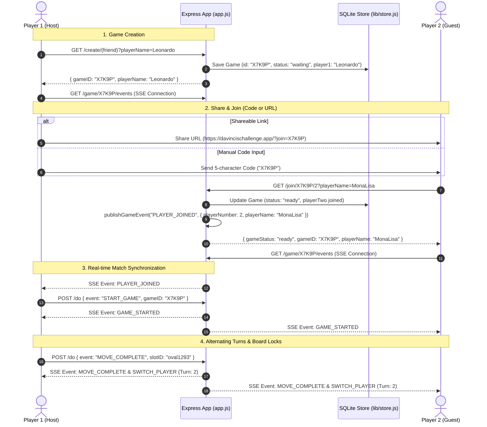

# 2-Player Mode ("Play a Friend") Architecture & Implementation Plan

## Executive Overview

This document outlines the recommended architecture and step-by-step implementation plan for **2-Player Mode ("Play a Friend")** in **Da Vinci's Challenge**. 

Building on the persistent **SQLite + Server-Sent Events (SSE)** architecture, 2-player matches allow two real human players to play against each other in real-time across different devices or browser tabs, with full state recovery upon page refresh or network disconnection.

---

## Target 2-Player Workflow Diagram



---

## Detailed Component Specifications

### 1. Dual Joining Mechanisms

Players should be able to connect via two distinct methods:

#### A. Shareable Direct URL (`?join=CODE`)
- When Player 1 clicks **Play a Friend**, the Web Share API (or clipboard copy) provides a URL formatted as:
  `https://dvc.nervoussow.com/?join=X7K9P`
- On client load (`DOMContentLoaded` in `main.js`), check for the `join` query parameter in `window.location.search`.
- If present, auto-fill the game ID, set `GAME.myPlayerNumber = 2`, connect the SSE stream (`connectGameStream(gameID)`), and execute `joinGame(2)`.

#### B. Manual Code Entry ("Play a Friend" Modal)
- In `public/resources/content-blocks/modal-two-player.html`:
  - **`#inpJoinGameCode`**: Input field accepting the 5-character code with auto-uppercasing and `maxlength="5"`.
  - **`#btnJoinGame`**: Button that triggers `joinGame(2)` using the typed code.

---

### 2. Client-Side Turn & Cup Locking

To prevent out-of-turn play or accidental selection of the opponent's pieces, client-side interactions are restricted based on `GAME.myPlayerNumber` and `GAME.currentPlayer`:

```javascript
function updatePlayerLocks() {
    const isMyTurn = (GAME.currentPlayer === GAME.myPlayerNumber)

    // 1. Cup Locking: Player can only interact with their own piece cup
    if (GAME.myPlayerNumber === 1) {
        $('#p1-oval-cup').classList.remove('no-pointer-events')
        $('#p1-triangle-cup').classList.remove('no-pointer-events')
        $('#p2-oval-cup').classList.add('no-pointer-events')
        $('#p2-triangle-cup').classList.add('no-pointer-events')
    } else if (GAME.myPlayerNumber === 2) {
        $('#p2-oval-cup').classList.remove('no-pointer-events')
        $('#p2-triangle-cup').classList.remove('no-pointer-events')
        $('#p1-oval-cup').classList.add('no-pointer-events')
        $('#p1-triangle-cup').classList.add('no-pointer-events')
    }

    // 2. Board Locking: Board slots are inactive unless it is the player's turn
    if (isMyTurn) {
        $('#fol-container').classList.remove('no-pointer-events')
    } else {
        $('#fol-container').classList.add('no-pointer-events')
    }
}
```

---

### 3. Real-time Event Stream Protocol (SSE)

The SSE event stream handles all 2-player state synchronization:

| Event Type | Trigger | Payload Contents | Client Action |
| :--- | :--- | :--- | :--- |
| `PLAYER_JOINED` | Player 2 joins room | `{ gameID, playerNumber: 2, playerName }` | Hide waiting overlay for Player 1, trigger `START_GAME` |
| `GAME_STARTED` | Game initialization | `{ gameID, gameType: "(friend)" }` | Initialize board layout & show score toast |
| `MOVE_STARTED` | Player selects/stages piece | `{ gameID, currentPlayer }` | Show active staging highlight |
| `MOVE_COMPLETE` | Player places piece in slot | `{ gameID, slotID, currentPlayer, availableSlots }` | Render filled SVG slot, check scoring & game over |
| `SCORE` | Pattern completed | `{ gameID, currentPlayer, symbol, points, slots }` | Animate pattern highlight & update score counters |
| `SWITCH_PLAYER` | Turn change | `{ gameID, currentPlayer }` | Update `GAME.currentPlayer` and call `updatePlayerLocks()` |

---

### 4. Persistence & State Recovery

If either player reloads their browser, closes the tab, or loses their network connection:

1. **Local Identity**: Client reads `GAME.id` and `GAME.myPlayerNumber` saved in local `sessionStorage`.
2. **State Snapshot**: Client calls `GET /game/:gameID/state` to fetch the authoritative game record from SQLite (`lib/store.js`).
3. **DOM Rehydration**:
   - Re-populates `#player1-score` and `#player2-score`.
   - Re-applies filled SVG slot styles (`#eeeeee` for Player 1, `#060606` for Player 2).
   - Re-connects the SSE stream (`connectGameStream(gameID)`).
   - Calls `updatePlayerLocks()` to set turn controls.

---

## Testing Strategy

To ensure 2-player mode operates reliably, add an automated integration test:

- **`tests/integration/two-player-sse.test.js`**:
  - Simulates two HTTP/SSE client connections representing Player 1 and Player 2.
  - Tests player 1 game creation $\rightarrow$ player 2 joining $\rightarrow$ real-time move propagation $\rightarrow$ scoring broadcast $\rightarrow$ state recovery upon client reconnect.
